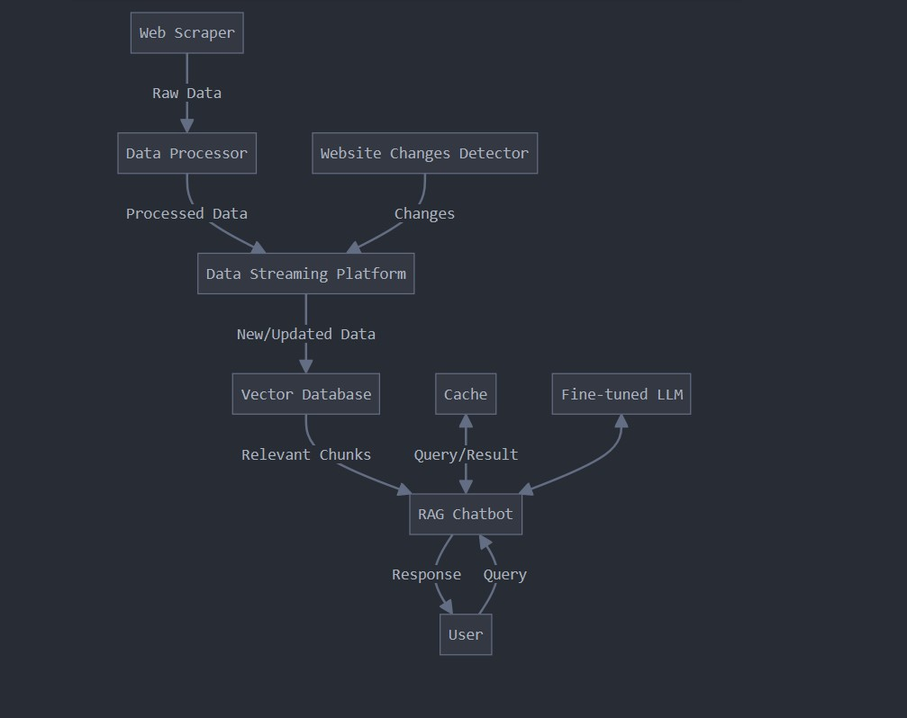

# Intern-project-stuff 
Now we have to discuss stuff regarding system design and other architectures. Also to do literature survey of RAG and RAFT and other related stuff.  

## FOR REVIEW 2
- Complete Literature Survey. (Wrt to paper lit review of papers, Joseph and I will prepare a doc of the papers on Litmaps).
  - The results of the repos mentioned by Joseph has to be done by Mathias, Christie and Terrence.
- Flowcharts and diagrams are ready. Since we not using a DB, no ER diagrams and all. Another addition of the flowchart is there below. Check for any additions or issues in them. Even with the diagrams.
#### NEXT WEEK
- Have to explain project idea in detail, will do this with Merwyn sir. Do the same for the next review. Everyone explains their part properly. 
-  Explain each concept clearly to sir and at the review.

`If there is anything else to be added, add it here.`

  

